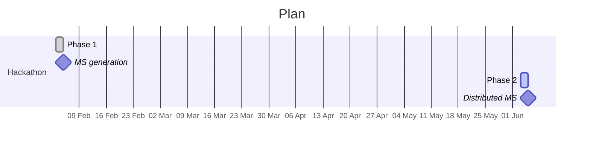

<div align="center">
  <table width="100%" border="0">
    <tr>
      <td style="text-align: center; vertical-align: middle; width: 33%;">
        <strong>HACKATHON : 3-5/02/2025</strong>
      </td>
      <td style="text-align: center; vertical-align: middle; width: 33%;">
        
      </td>
      <td style="text-align: center; vertical-align: middle; width: 33%;">
        <strong>TEAM simulation</strong>
      </td>
    </tr>
  </table>
</div>


# Generating distributed MeasurementSet

#### Interferometric context
Radio interferometric imaging uses interferometers to measure visibilities, which are samples of the sky obtained from pairs of antennas. To transform these visibilities into an image of the sky, imaging algorithms generally use two main steps: a major loop (∆) and a minor loop (Ψ).

- The major loop (∆) manages the transformation of the visibilities into a *dirty* image of the sky via gridding and screening operations. `Gridding` consists of projecting the visibilities onto a regular grid in the *uv* plane in order to facilitate the application of the Fast Fourier Transform (FFT) to generate a dirty image. `Degridding` performs the opposite operation, comparing the visibilities calculated from an image model and adjusting them accordingly. 
- The minor loop (Ψ) is used to clean the dirty image of artefacts introduced by the instrumentation. Of the algorithms available, Clean by Hogbom [2] is the most commonly used. This algorithm first identifies the dominant sources in the dirty image, then models these sources while removing the artefacts associated with the instrumental response (PSF). Finally, the image is updated iteratively until it converges on a clean version.

By combining these two loops, it is possible to obtain an accurate image of the sky from the raw data provided by the interferometer.

<div align="center">
  <table width="100%" border="0">
    <tr>
      <td style="text-align: center; vertical-align: middle; width: 50%;">
        
      </td>
      <td style="text-align: center; vertical-align: middle; width: 50%;">
        
      </td>
    </tr>
  </table>
</div>


Most interferometric imagers (ddfacet, sep, generic imaging pipeline etc) take a [MeasurementSet](https://casa.nrao.edu/Memos/229.html) *.ms file as input and generate an image as output. The most commonly used format is [Flexible Image Transport System (FITS)](https://www.aanda.org/articles/aa/abs/2010/16/aa15362-10/aa15362-10.html) *.fits.

#### Project motivation

As we are keen to benchmark the performance of our pipelines over a wide range of case studies, and as we don't have access to telescopes, we are going to generate our own `MeasurementSet` on which we will have control over the configuration of the instruments and the image of the true sky. 


This project aim to create `visibilities.ms` from `output.fits` image which correspond to the reverse steps of standard radio-astronomy imaging pipeline. All the process are contained in the notebook except the `ska_sdp_datamodels`  and  `ska-sdp-func-python` install them before benefiting from this project.

```bash
git clone https://gitlab.com/ska-telescope/sdp/ska-sdp-datamodels.git
cd ska_sdp_datamodels
pip install --extra-index-url https://artefact.skao.int/repository/pypi-internal/simple ska-telmodel
pip install .
cd ..

git clone https://gitlab.com/ska-telescope/sdp/ska-sdp-func-python.git
cd ska-sdp-func-python
pip install .
cd..

pip install python-casacore

pip install notebook
```
Then run the python notebook
```bash
jupyter notebook
```

## Repository structure

```plaintext
├── SGRA_full_gt.fits        # Input image considered as the true sky  
├── spectral_fits/           # Folder containing the image as a spectral cube  
│   ├── *.fits  
├── instrumented_vis_fits/   # Folder containing visibilities with instrument noise  
│   ├── *.fits  
├── spectral_ms/             # Folder containing the distributed MeasurementSet  
│   ├── *.ms  
├── fits_to_vis.ipynb        # Notebook to generate all files from the input image  
```
## Planning
This hackathon comprises 2 phases:
- Phase 1: getting to grips with the SKA SDP libraries, generation of the first MS, and first test as ddfacet input.
- Phase 2: generation of distributed and configurable MS, validation via casacore.



## Contact  

For questions or feedback, please contact:  
- [Ophélie Renaud](mailto:ophelie.renaud@ens-paris-saclay.fr)

## References

The notebook employ SKA SDP libraries:

📂 [ska-sdp-func-python git](https://gitlab.com/ska-telescope/sdp/ska-sdp-func-python)

📘 [ska-sdp-func-python doc](https://developer.skao.int/projects/ska-sdp-func-python/en/latest/)

📂 [ska-sdp-func-datamodels git](https://gitlab.com/ska-telescope/sdp/ska-sdp-datamodels)

📘 [ska-sdp-func-datamodels doc](https://developer.skao.int/projects/ska-sdp-datamodels/en/latest/)

📂 [rascil git](https://gitlab.com/ska-telescope/external/rascil-main)

📘 [rascil doc](https://developer.skao.int/projects/rascil/en/latest/index.html)

🔗 [CASA](https://casadocs.readthedocs.io/en/stable/notebooks/synthesis_imaging.html) --> section **Types of images** for the various spectral distribution

## Acknowledge

*This project is part of the ECLAT labcom hackathon.*

[](https://ophelie-renaud.github.io/vis-generator/wast.html)

